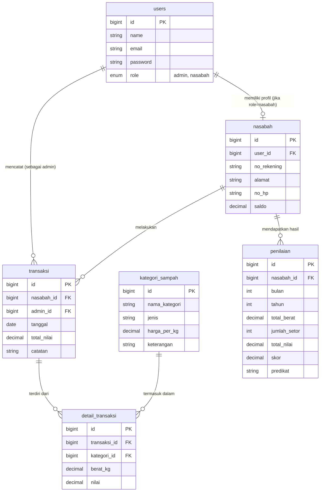
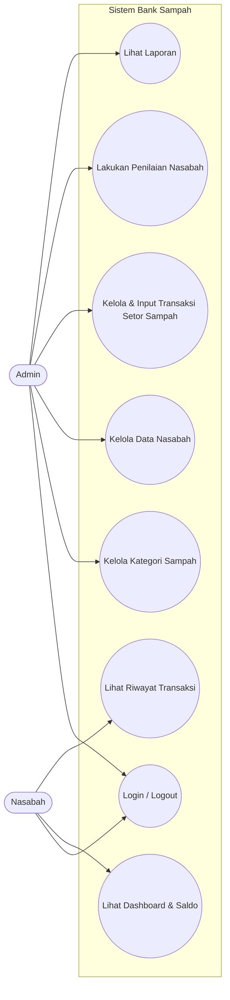
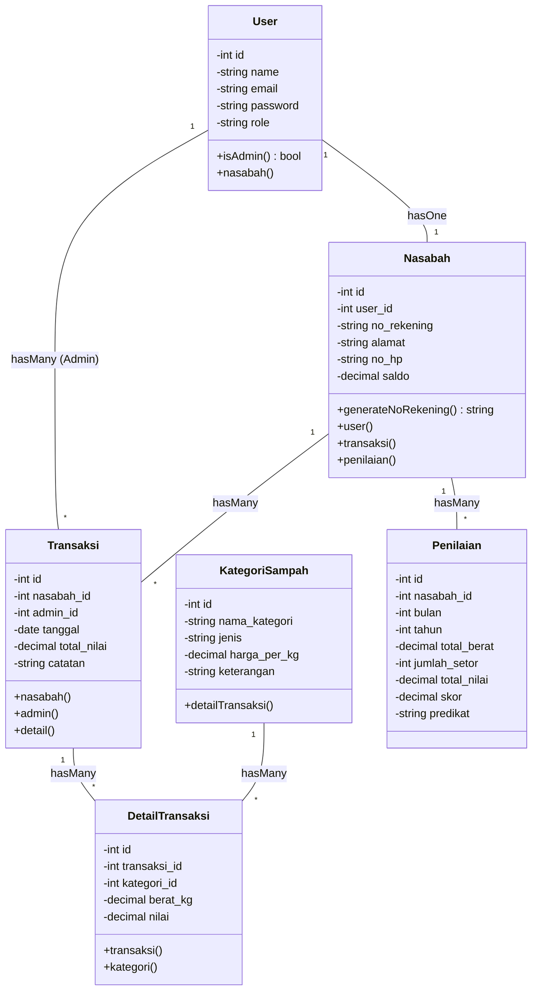
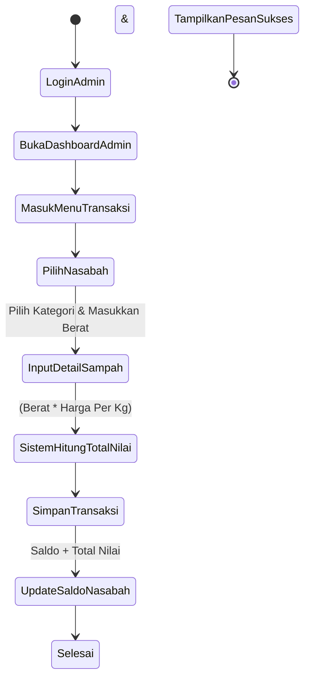
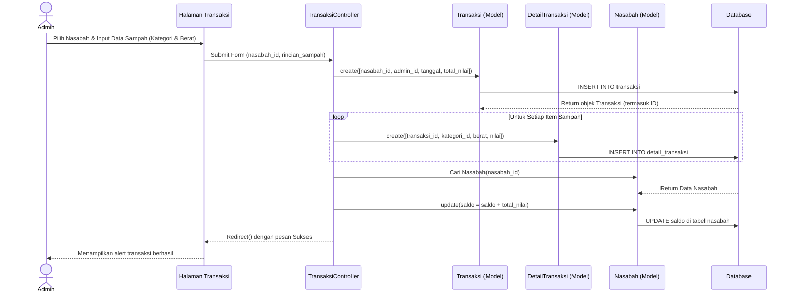

# Dokumentasi Perancangan Sistem Bank Sampah

Dokumen ini berisi berbagai diagram perancangan untuk sistem Bank Sampah berdasarkan struktur model dan controller yang ada di dalam proyek. Diagram menggunakan sintaks Mermaid.

## 1. Entity Relationship Diagram (ERD) & Logical Record Structure (LRS)
ERD dan LRS menggambarkan struktur tabel, *primary key* (PK), *foreign key* (FK), dan relasi antar tabel pada database `bank-sampah`.

## 2. Use Case Diagram
Diagram Use Case ini menunjukkan apa saja fitur yang dapat diakses oleh Aktor `Admin` dan `Nasabah` di dalam sistem.

## 3. Class Diagram
Class diagram berikut menggambarkan struktur representasi *Model* dalam aplikasi Laravel, beserta metode-metode utama (termasuk metode untuk relasi *Eloquent*).

## 4. Activity Diagram (Proses Setor Sampah)
Activity diagram ini menggambarkan alur kerja langkah demi langkah ketika Admin sedang memproses atau menginput Setor Sampah dari Nasabah.

## 5. Sequence Diagram (Proses Simpan Transaksi Setor Sampah)
Sequence diagram ini menggambarkan interaksi antar komponen (View, Controller, Model, Database) dalam urutan waktu tertentu saat proses Setor Sampah (Input Transaksi) dijalankan.

